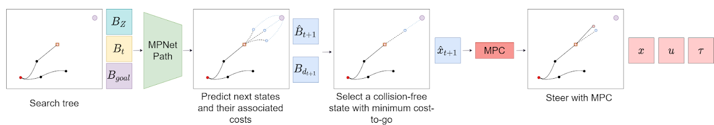
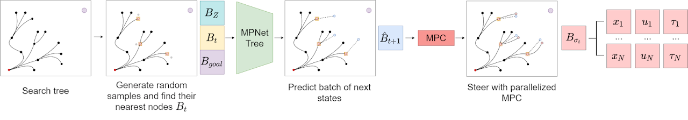

# MPC-MPNet
Implementation of Model Predictive Motion Planning Network 

[Website](https://sites.google.com/view/mpc-mpnet) | [Paper](https://arxiv.org/abs/2101.06798)

## MPC-MPNet-Path

## MPC-MPNet-Tree


## Instructions
### Compile Modules
cd into **deps/** and build cpp modules based on sparse-rrt python binding.  

***[Important]Please make sure all sys.path inside scripts you need have been updated to your own version. Such as [benchmark.py](https://github.com/LeeLinJun/mpc-mpnet-py/blob/master/benchmarks/benchmark.py) and scripts inside [expriments](https://github.com/LeeLinJun/mpc-mpnet-py/tree/master/benchmarks/experiments)***

### Data generation
The **data_gen** folder contains code and scripts for four envrionments: acrobot, cart-pole, car and quadrotor.
```bash
cd data_gen
# For parallelization, run the script in i different process:
bash datagen_${system}_batch${i}.sh
```
### Model Training
Preprocess obstacles and state-goal paris with **process_data.py**, **process_obs.py** in **mpnet/sst_envs**
Train the network with **mpnet/train_mpnet.py**.

For costnet in MPC-MPNet-Path, use **mpnet/train_costs.py** 
### Benchmarking
Editing parmas in **params** folder and run with script
```bash
# example: bash scripts/acrobot_obs/mp_tree.sh
bash scripts/${system}/${method}.sh
```


## Citation
If you find this open source release useful, please reference in your paper:
```bibtex
@misc{2101.06798,
Author = {Linjun Li and Yinglong Miao and Ahmed H. Qureshi and Michael C. Yip},
Title = {MPC-MPNet: Model-Predictive Motion Planning Networks for Fast, Near-Optimal Planning under Kinodynamic Constraints},
Year = {2021},
Eprint = {arXiv:2101.06798},
}
```
